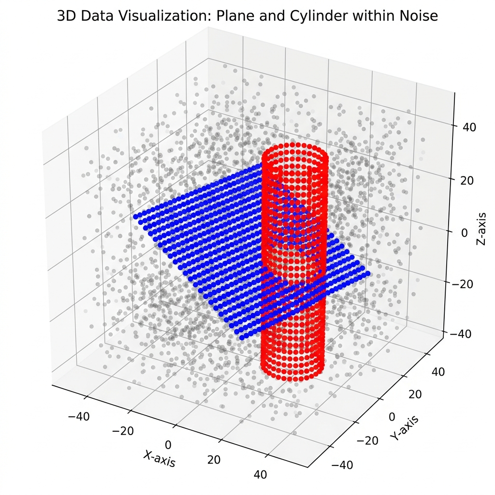

# Schnabel Efficient RANSAC — Cython Wrapper

This directory contains a complete, highly-optimized Cython wrapper that allows you to use **Schnabel's Efficient RANSAC C++ algorithm** directly from Python.

## Why We Built This (The Advantages)

1. **Extreme Speed:** Writing iterative algorithms like RANSAC in pure Python is incredibly slow. By wrapping the original C++ engine, you get raw C++ execution speeds (processing tens of thousands of points in fractions of a second) without ever having to write C++ code yourself.
2. **Modern Data Science Integration:** The wrapper natively accepts and returns **NumPy arrays**. This means you can easily slot this legacy 2007/2009 C++ codebase into a modern AI pipeline using libraries like Open3D, PyTorch, or Matplotlib.
3. **Avoiding Re-invention:** Schnabel’s C++ code uses highly complex spatial data structures (KD-Trees, Octrees) and custom mathematical solvers for Cylinders, Tori, and Spheres. Instead of trying to painfully rewrite this in Python, Cython acts as a "bridge" to use the original, bulletproof code natively.
4. **Cross-Platform & Multi-Threading:** The `setup.py` has been modernized to compile seamlessly on both **macOS/Linux** (using Clang/GCC) and **Windows** (using MSVC). Because it is written in Cython, it can also bypass Python's Global Interpreter Lock (GIL) for true parallel processing.

---

## How to Compile

Open your terminal (or Command Prompt/PowerShell on Windows), navigate to this directory, and run:
```bash
python setup.py build_ext --inplace
```
This will compile the C++ source code and the Cython bridge into a shared library module (`.so` on Mac/Linux or `.pyd` on Windows) that can be imported directly into Python via `import schnabel_ransac`.

---

## What `visual_demo.py` Actually Does

If you run `python visual_demo.py`, you will see a 3D plot pop up:



Here is a breakdown of exactly what is happening behind the scenes to produce that plot:

### 1. Creating the "Messy" World
The Python script uses NumPy to generate 5,000 random dots in 3D space:
*   2,000 dots mathematically form a flat **Plane**.
*   2,000 dots mathematically form a **Cylinder**.
*   1,000 dots are entirely random **Noise** scattered everywhere.

All 5,000 dots are then shuffled together. To Python, this is just a massive, unorganized list of `[X, Y, Z]` coordinates.

### 2. The C++ Engine Takes Over
The script passes this massive list into our `schnabel_ransac.detect()` Cython function. In a fraction of a second, the C++ code does the heavy lifting:
1. It builds a spatial **KD-Tree** to quickly organize and search the 5,000 dots.
2. It calculates the surface normal (the mathematical angle) for every single dot using Principal Component Analysis (PCA).
3. It uses the RANSAC algorithm to randomly sample points, guess shapes, and verify if the surrounding points fit the mathematical equation of a Plane or Cylinder.

### 3. The Result
The C++ algorithm successfully identifies the hidden geometry and returns the exact point assignments back to Python. The 3D plot proves that it worked perfectly:
*   The faint **grey dots** are the 1,000 noise points, which the algorithm correctly ignored.
*   The brightly **colored dots** (e.g., blue and red) are the points that the C++ algorithm successfully identified and pulled out of the noise as the hidden Plane and Cylinder!

---

## Testing on Real-World Data (`real_data_demo.py`)

If you want to see how this performs on a real 3D LiDAR/RGB-D scan, you can run:
```bash
python real_data_demo.py
```
*(Requires `pip install open3d`)*

### What it does:
1. **Downloads a Dataset**: It automatically downloads the Open3D "Living Room Fragment" (a real-world 3D scan of an indoor room, taking up about 2 MB).
2. **Restricts to Planes**: It explicitly configures the C++ wrapper to **ONLY look for planes** (by passing `shapes=["plane"]`). This is highly useful for architectural segmentation (finding walls, floors, and ceilings).
3. **Segments the Room**: The C++ engine processes the tens of thousands of real-world points in a fraction of a second.
4. **Visualizes**: It opens an interactive Open3D window where the entire room is grey, but the detected planes (like the floor and major walls) are brightly painted in distinct colors.
